# Exchange office
System implemented in Microservice Architecture

## Main repository 
-> This repository gathers all microservices and projects involved in the development of a exchange-office system.

## Repositories used for development of the microservices
-> <a href="https://github.com/pedroluiznogueira/microservices-currency-conversion-service">Currency Conversion Microservice</a>  
-> <a href="https://github.com/pedroluiznogueira/microservices-currency-exchange-service">Currency Exchange Microservice</a>  
-> <a href="https://github.com/pedroluiznogueira/microservice-spring-cloud-config-server">Limits Microservice</a>  
 
-> <a href="https://github.com/pedroluiznogueira/kubernetes">Docker Techniques Used Documented</a>  
-> <a href="https://github.com/pedroluiznogueira/docker">Kubernetes and Google Cloud Kubernetes Engine Techniques Used Documented</a>  
-> <a href="https://github.com/pedroluiznogueira/microservices-api-gateway">API Gateway</a>  
 
-> <a href="https://github.com/pedroluiznogueira/microservice-spring-cloud-config-server">Spring Cloud Centralized Configuration</a>  
 
-> <a href="https://github.com/pedroluiznogueira/microservice-spring-cloud-config-server">Centralized Configuration With Git Repository</a>  
 
-> <a href="https://github.com/pedroluiznogueira/microservice-spring-cloud-config-server">Spring Cloud Centralized Configuration</a>  
 
-> <a href="https://github.com/pedroluiznogueira/microservice-spring-cloud-config-server">Eureka Server Configuration</a>  

### Centralized Configuration

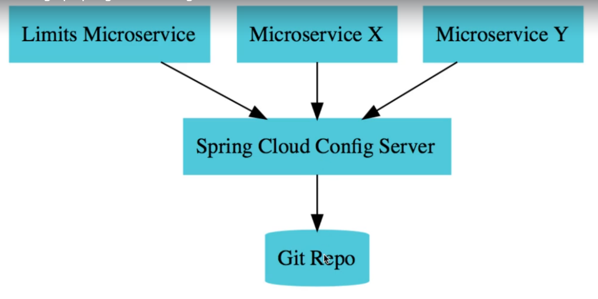

### Limits Service

- configuration dependency

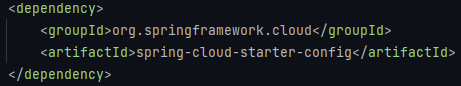

- that's the reference to the centralized configuration server
- the limits will be retrieved from the config server

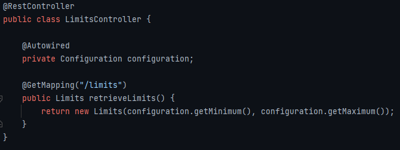

- we can define them hard coded in properties
- these values

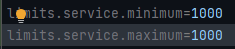

- are mapped to those attributes

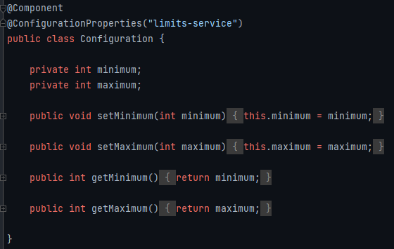

### Spring cloud config server

- naming the applications is a good practice

- that application will fetch data from the files
- wich are on the git repository

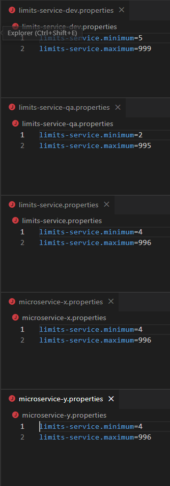

- then each microservice will fetch the centralized
- spring cloud config server wich fetches from the
- git repository

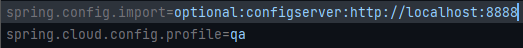

- since the spring cloud config server runs in port
- 8888, if we define the profile as qa, the data fetched
- will be

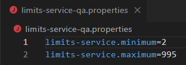

- so each microservice can define each own profile to
- pass forward to the spring cloud config application
- to allow the configurarion we need to enable it using

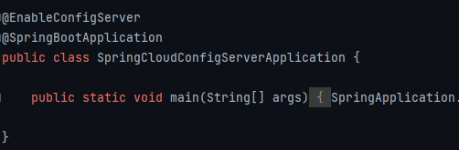

- checking the spring cloud configuration server
- 

### Currency Exchange & Currency Conversion

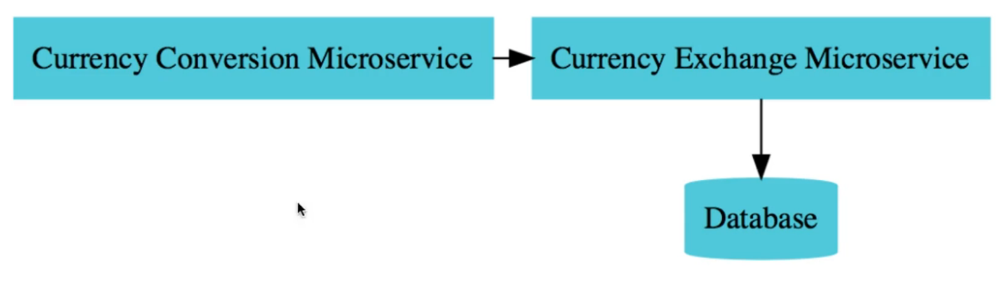

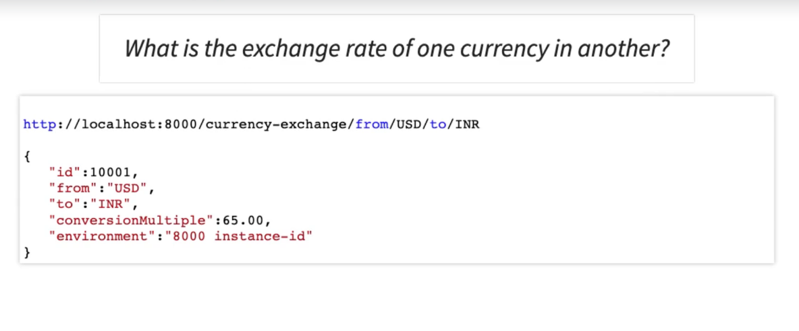

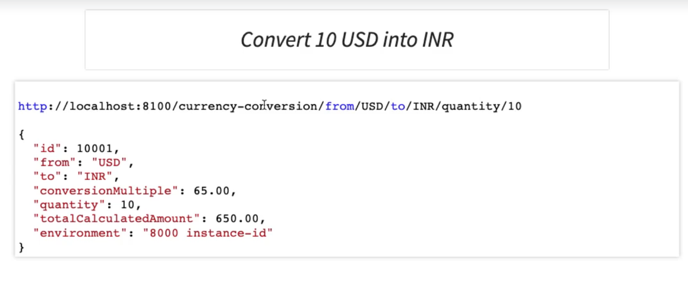

### Currency Exchange

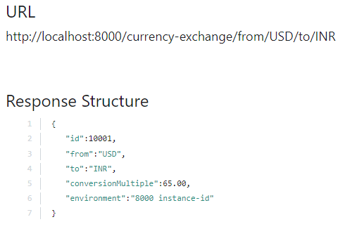

- good practices

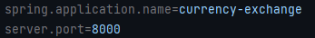

- connecting to the spring cloud config server

- currency exchange entity

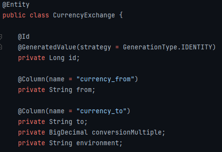

- dynamic ports in the response

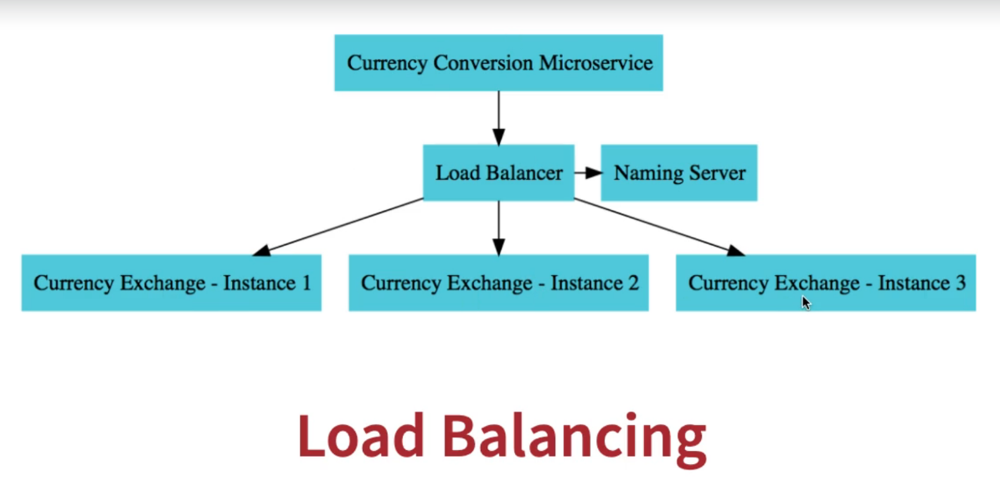

- we need to know wich instance of the currency exchange
- is providing the response when we call it from the
- currency conversion, so we know if the load balancer
- is working fine

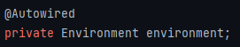

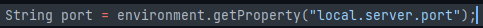

- no matter what instance is being called, the port it is
- up on, will be sent in the response
- we cant test it locally setting the server.port and run 
- different projects for the same microservice in intellij

 

- setting up in memory database to mock some data in /resources
- import to remember h2 and jpa dependency

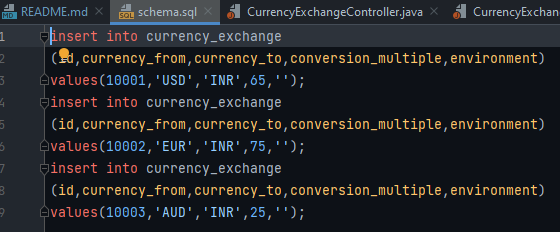

- fetching the data from database

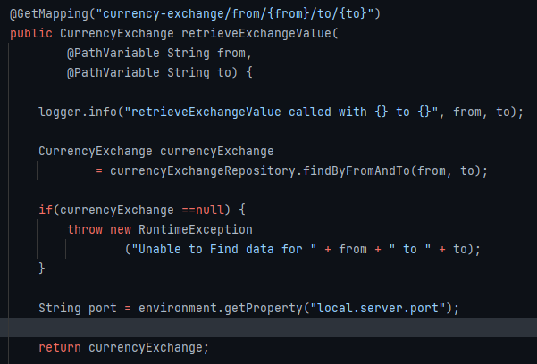

- payload

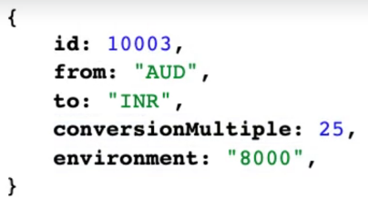

### Currency Conversion

- currency conversion will fetch data from currency exchange
- so we can know the necessary data to make the conversion

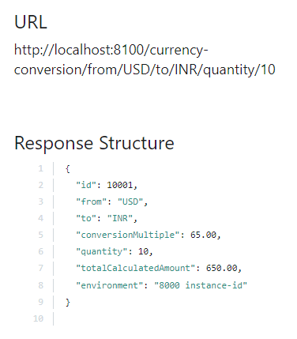

- good practice

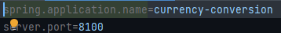

- currency conversion entity

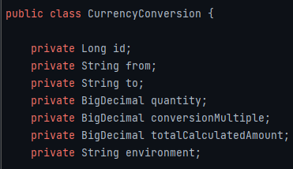

- communication between the microservice without Feign

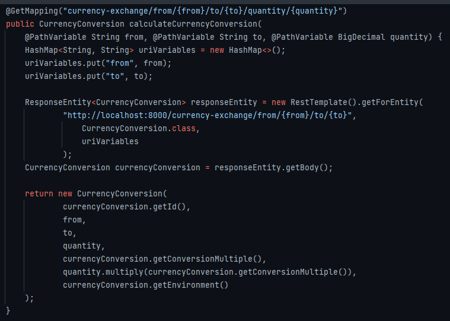

- communication between the microservice with Feign

- spring cloud feign dependency

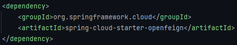

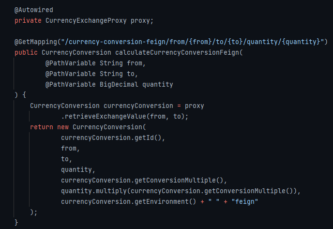

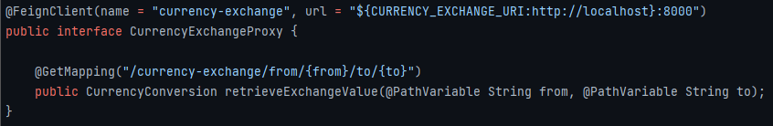

### Naming server

- the problem is if we need to change the port that we call
- from the currency conversion through feign to currency
- exchange, we need to hard code it and go and change

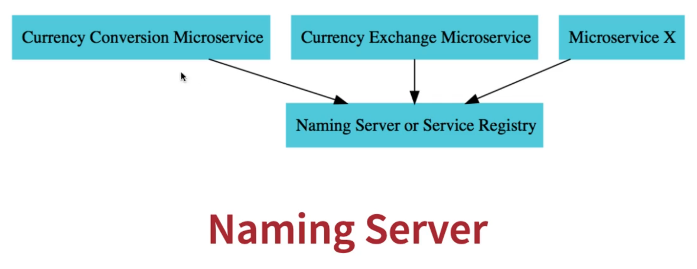

- is kind of like the naming server is asked for a instance
- and together with the load balancer it gives the instances
- back to who calls it

 

- we can use Eureka Server from spring cloud

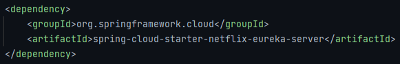

- enabling Eureka Server

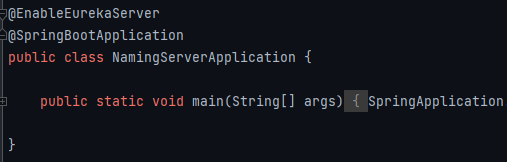

- good practice

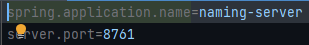

- since we don't want it self to register in the server

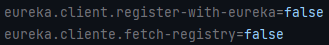

- connecting the microservices to the naming server
- we need to add the eureka dependency to the microservices

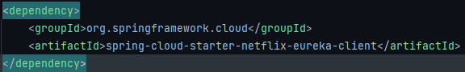

- just from adding the dependency it will connect to the naming
- server, but is better to make it explicit

### Load balancing

- we want to load balance the intances of currency exchange
- when they are called from the currency conversion microservice
- we just need to make the feign call it like this

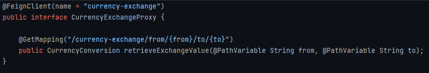

- so the instances registers in eureka, locally we can see it
- when running two different projects of the same microservice
- so once we call the currency exchange microservices it is
- load balanced

 

- lately the load balancer was ribbon, but now it is implemented
- by eureka

### API Gateway

- lately it was implemented with Zuul, but now it is implemented
- by spring cloud gateway

 

- we want the api gateway to connect to eureka server, so we need
- the eureka dependency

- spring cloud gateway dependency

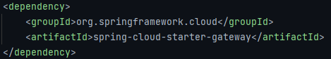

- good practice

- registering api gateway to the naming server

- the idea is to the api gateway to recieve a request and then
- talk to the naming server, find the refereed microservice 
- end-point as pass it forward

 

- since it is already registered in eureka, we just configure

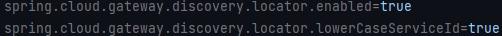

- now every request go through the gateway

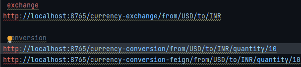

- customizing the routes to be redirecteds

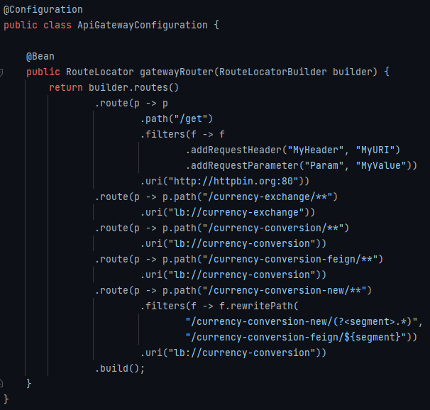

- filtering requests from gateway

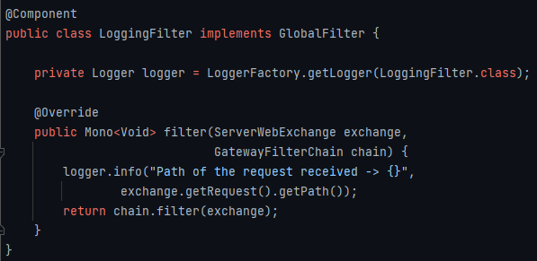

- pointing out spring cloud gateway

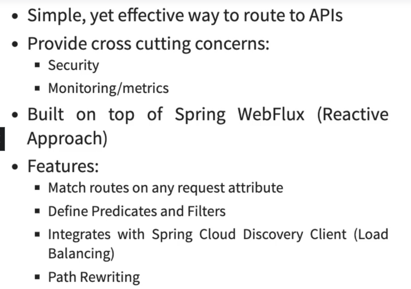

### Circuit breaker

- lately Hystrix was the used circuit breaker
- but Resillience4j was implemented to take care of Java 8 features

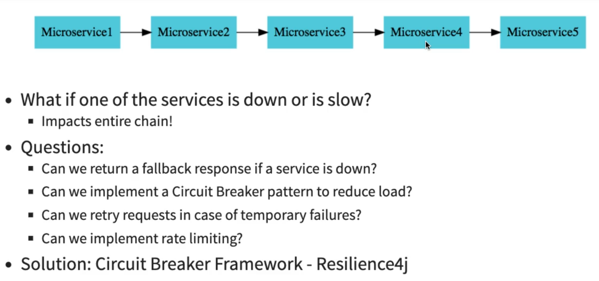

- needed dependencies

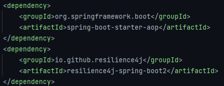

- @Retry
- it could be a call to some other api using feign

 

- with default, if it fails it makes three attempts, only then if
- it continues failing it return the error back

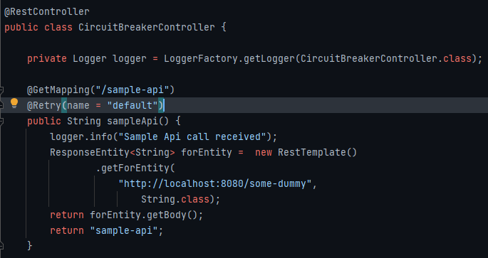

- custom retry configuration

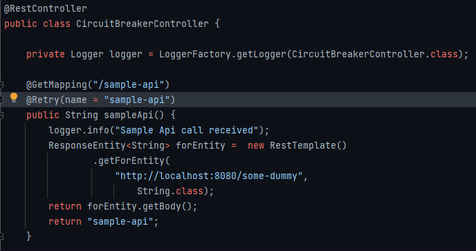

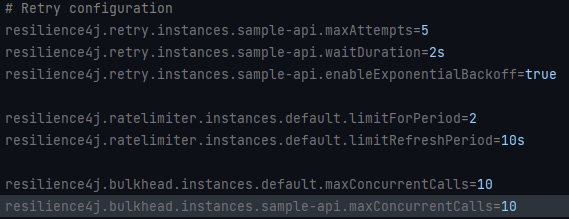

- fallback
- it refeers to a method in the class, and it could return anything
- it could be some fallback response stored in database, memory, cache
- or some file

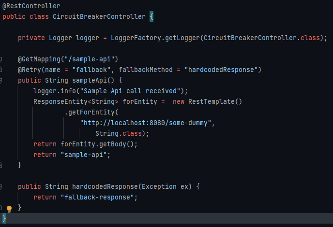

- all of the retry configurations comes into play when handling with
- fallback responses

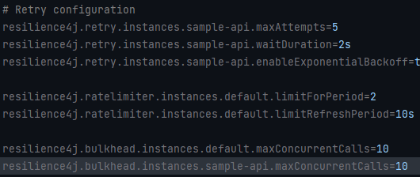

- @CircuitBreaker
- we can test it with a combination of curl and watch

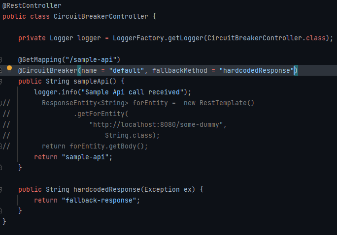

- the circuite breaker gives the return back without calling
- the methods
- because it sees that there are so many requests
- so it break the circuit and return responses

 

- close state
- calling continuosly
- open state
- it won't call the directed microservice, return the fallback directly
- half open state
- sending a percentage of requests, and then returns the fallback

 

- rate limits for a specific api call in the method you use it

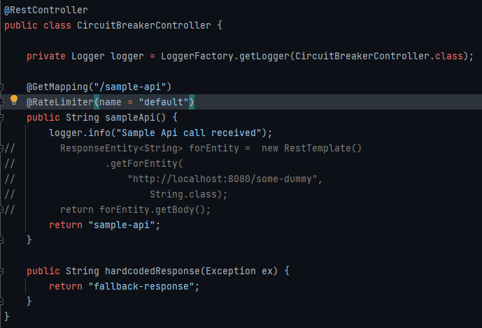

- bulkhead limits concurrent calls

